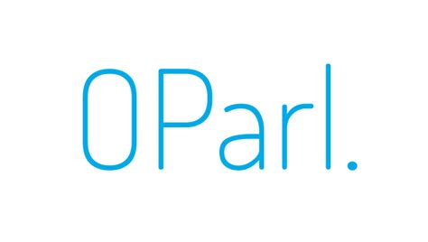

<div align="center">

# OParl MCP Server




**A Model Context Protocol (MCP) server for accessing OParl parliamentary data APIs**

[](https://github.com/jtwolfe/oparl-mcp-server)
[](https://github.com/jtwolfe/oparl-mcp-server/fork)
[](https://github.com/jtwolfe/oparl-mcp-server/issues)
[](https://github.com/jtwolfe/oparl-mcp-server/blob/main/LICENSE)
[](https://www.python.org/downloads/)
[](https://modelcontextprotocol.io)

[📚 Documentation](https://jtwolfe.github.io/oparl-mcp-server/) • [🚀 Quick Start](#-quick-start) • [🏛️ OParl API](#-oparl-api) • [🔧 Configuration](#️-configuration) • [🐳 Docker](#-docker)

</div>

## ⚠️ Project Status

**This project is currently in development and requires additional validation and testing.** While the core functionality is implemented, it has not been thoroughly tested in production environments. Please use with caution and report any issues you encounter.

## 🎯 Overview

The OParl MCP Server provides AI models and applications with seamless access to OParl parliamentary data APIs through the Model Context Protocol. It enables natural language queries and structured access to parliamentary information systems across multiple implementations.

## ✨ Features

- **🔌 MCP Integration**: Full Model Context Protocol compliance
- **🏛️ OParl 1.1 Support**: Complete support for all OParl object types
- **🌐 Multi-Implementation**: Works with various OParl implementations
- **🔐 Authentication**: Flexible API key and Bearer token support
- **📊 Rich Data Access**: Parliamentary meetings, documents, organizations, and more
- **🔍 Advanced Search**: Query parameters and filtering capabilities
- **🐳 Docker Ready**: Containerized deployment with Docker Compose
- **🧪 Comprehensive Testing**: Unit tests and integration tests included
- **📚 Extensive Documentation**: Complete API reference and usage guides

## 🏛️ OParl API

The server provides access to all standard OParl 1.1 object types:

| Object Type | Description | Key Properties |
|-------------|-------------|----------------|
| **System** | Root system information | `oparlVersion`, `body`, `created` |
| **Body** | Parliamentary bodies | `name`, `shortName`, `organization` |
| **Organization** | Political parties & groups | `name`, `shortName`, `member` |
| **Person** | Representatives & officials | `name`, `givenName`, `familyName` |
| **Meeting** | Parliamentary sessions | `name`, `start`, `end`, `location` |
| **AgendaItem** | Meeting topics | `name`, `meeting`, `order` |
| **Paper** | Documents & resolutions | `name`, `reference`, `date` |
| **Consultation** | Public consultations | `name`, `paper`, `start`, `end` |
| **File** | Attachments & media | `name`, `mimeType`, `accessUrl` |
| **Location** | Meeting venues | `name`, `geojson`, `postalCode` |

## 🚀 Quick Start

### Prerequisites

- Python 3.11 or higher
- pip (Python package manager)

### Installation

1. **Clone the repository**
   ```bash
   git clone https://github.com/jtwolfe/oparl-mcp-server.git
   cd oparl-mcp-server
   ```

2. **Create a virtual environment**
   ```bash
   python -m venv venv
   source venv/bin/activate  # On Windows: venv\Scripts\activate
   ```

3. **Install dependencies**
   ```bash
   pip install -r requirements.txt
   ```

4. **Run the server**
   ```bash
   python -m oparl_mcp.server
   ```

### Development Setup

For development, install additional dependencies:

```bash
pip install -r requirements-dev.txt
```

## ⚙️ Configuration

The server can be configured using environment variables or programmatically:

### Environment Variables

```bash
export OPARL_BASE_URL="https://api.oparl.org"
export OPARL_API_KEY="your-api-key"  # Optional
export OPARL_TIMEOUT="30.0"
export OPARL_LOG_LEVEL="INFO"
export OPARL_SERVER_NAME="OParl MCP Server"
```

### Programmatic Configuration

```python
from oparl_mcp import OParlConfig, OParlMCPServer

# Create configuration
config = OParlConfig(
    base_url="https://oparl.muenchen.de",
    api_key="your-munich-api-key",
    timeout=60.0,
    server_name="Munich OParl Server"
)

# Create and run server
server = OParlMCPServer(config)
server.run()
```

## 🌍 OParl Implementations

The server works with various OParl implementations:

| Implementation | URL | Description |
|----------------|-----|-------------|
| **Generic OParl API** | `https://api.oparl.org` | Standard OParl implementation |
| **Munich City Council** | `https://oparl.muenchen.de` | Munich parliamentary data |
| **Cologne City Council** | `https://oparl.koeln.de` | Cologne parliamentary data |
| **Hamburg Parliament** | `https://oparl.hamburg.de` | Hamburg parliamentary data |

Each implementation may have different:
- Authentication requirements
- Available data
- API endpoints
- Rate limits

## 🐳 Docker

### Using Docker Compose

1. **Create environment file**
   ```bash
   cp .env.example .env
   # Edit .env with your configuration
   ```

2. **Run with Docker Compose**
   ```bash
   docker-compose -f docker/docker-compose.yml up -d
   ```

### Using Docker directly

```bash
# Build the image
docker build -f docker/Dockerfile -t oparl-mcp-server .

# Run the container
docker run -p 8000:8000 \
  -e OPARL_BASE_URL=https://api.oparl.org \
  -e OPARL_API_KEY=your-key \
  oparl-mcp-server
```

## 📖 Usage Examples

### Basic MCP Client Usage

```python
from mcp import ClientSession, StdioServerParameters
from mcp.client.stdio import stdio_client

async def main():
    async with stdio_client(StdioServerParameters(
        command="python",
        args=["-m", "oparl_mcp.server"]
    )) as (read, write):
        async with ClientSession(read, write) as session:
            # List all meetings
            meetings = await session.list_resources()
            print(f"Found {len(meetings)} resources")
            
            # Get specific meeting
            meeting = await session.read_resource("oparl_meeting_123")
            print(f"Meeting: {meeting['name']}")
```

### Advanced Configuration

```python
from oparl_mcp import OParlMCPServer, OParlConfig

# Custom configuration for Munich
config = OParlConfig(
    base_url="https://oparl.muenchen.de",
    api_key="your-munich-api-key",
    timeout=45.0,
    server_name="Munich OParl MCP Server"
)

server = OParlMCPServer(config)
info = server.get_server_info()
print(f"Server: {info['name']}")
print(f"Features: {info['features']}")
```

## 🧪 Testing

Run the comprehensive test suite:

```bash
# Run all tests
pytest

# Run with coverage
pytest --cov=oparl_mcp --cov-report=html

# Run specific test file
pytest tests/test_server.py

# Run integration tests
python test_integration.py
```

## 📚 Documentation

Comprehensive documentation is available at [https://jtwolfe.github.io/oparl-mcp-server/](https://jtwolfe.github.io/oparl-mcp-server/):

- **[Getting Started](https://jtwolfe.github.io/oparl-mcp-server/getting-started/quickstart/)** - Quick setup and basic usage
- **[OParl API Guide](https://jtwolfe.github.io/oparl-mcp-server/user-guide/oparl-api/)** - Complete OParl API reference
- **[FastMCP Integration](https://jtwolfe.github.io/oparl-mcp-server/user-guide/fastmcp-integration/)** - Technical integration details
- **[Architecture](https://jtwolfe.github.io/oparl-mcp-server/user-guide/architecture/)** - System design and data flow
- **[API Reference](https://jtwolfe.github.io/oparl-mcp-server/api/server/)** - Complete API documentation
- **[Contributing](https://jtwolfe.github.io/oparl-mcp-server/development/contributing/)** - Development and contribution guide

## 🔧 MCP Components

### Resources
- **System Information**: Root system data and metadata
- **Body Collections**: Lists of parliamentary bodies
- **Meeting Schedules**: Upcoming and past meetings
- **Document Collections**: Papers and reports
- **Person Profiles**: Elected officials and staff

### Resource Templates
- **Individual Objects**: Specific meetings, people, papers, etc.
- **Parameterized Access**: Dynamic resource access with IDs
- **Structured Data**: Consistent data format across all objects

### Tools
- **Search Operations**: Find specific data across the system
- **Filter Operations**: Filter data by various criteria
- **Export Operations**: Export data in different formats

## 🏗️ Architecture

The server uses FastMCP to transform the OParl API into MCP-compatible components:

```
┌─────────────────┐    ┌─────────────────┐    ┌─────────────────┐
│   AI Model      │    │   MCP Client    │    │   MCP Server    │
│                 │◄──►│                 │◄──►│   (FastMCP)     │
└─────────────────┘    └─────────────────┘    └─────────────────┘
                                                       │
                                                       ▼
                                               ┌─────────────────┐
                                               │   OParl API     │
                                               │   (HTTP/REST)   │
                                               └─────────────────┘
```

## 🤝 Contributing

We welcome contributions! Please see our [Contributing Guide](https://jtwolfe.github.io/oparl-mcp-server/development/contributing/) for details.

### Development Setup

1. Fork the repository
2. Create a feature branch: `git checkout -b feature/new-feature`
3. Install development dependencies: `pip install -r requirements-dev.txt`
4. Make your changes
5. Add tests for new functionality
6. Run the test suite: `pytest`
7. Submit a pull request

## 📄 License

This project is licensed under the MIT License - see the [LICENSE](LICENSE) file for details.

## 🙏 Acknowledgments

- **[OParl Initiative](https://dev.oparl.org)** for the standardized parliamentary data API
- **[FastMCP](https://gofastmcp.com)** for the excellent MCP framework
- **[Model Context Protocol](https://modelcontextprotocol.io)** for the AI integration standard
- The open-source community for inspiration and support

## 📞 Support

- **Documentation**: [https://jtwolfe.github.io/oparl-mcp-server/](https://jtwolfe.github.io/oparl-mcp-server/)
- **Issues**: [GitHub Issues](https://github.com/jtwolfe/oparl-mcp-server/issues)
- **Discussions**: [GitHub Discussions](https://github.com/jtwolfe/oparl-mcp-server/discussions)

## 🔗 Related Projects

- [OParl Specification](https://dev.oparl.org/spezifikation) - Official OParl documentation
- [FastMCP Framework](https://gofastmcp.com) - MCP server generation framework
- [Model Context Protocol](https://modelcontextprotocol.io) - AI integration standard

---

<div align="center">

**Made with ❤️ for open government and AI accessibility**

[](https://github.com/jtwolfe/oparl-mcp-server)
[](https://github.com/jtwolfe/oparl-mcp-server/fork)

</div>