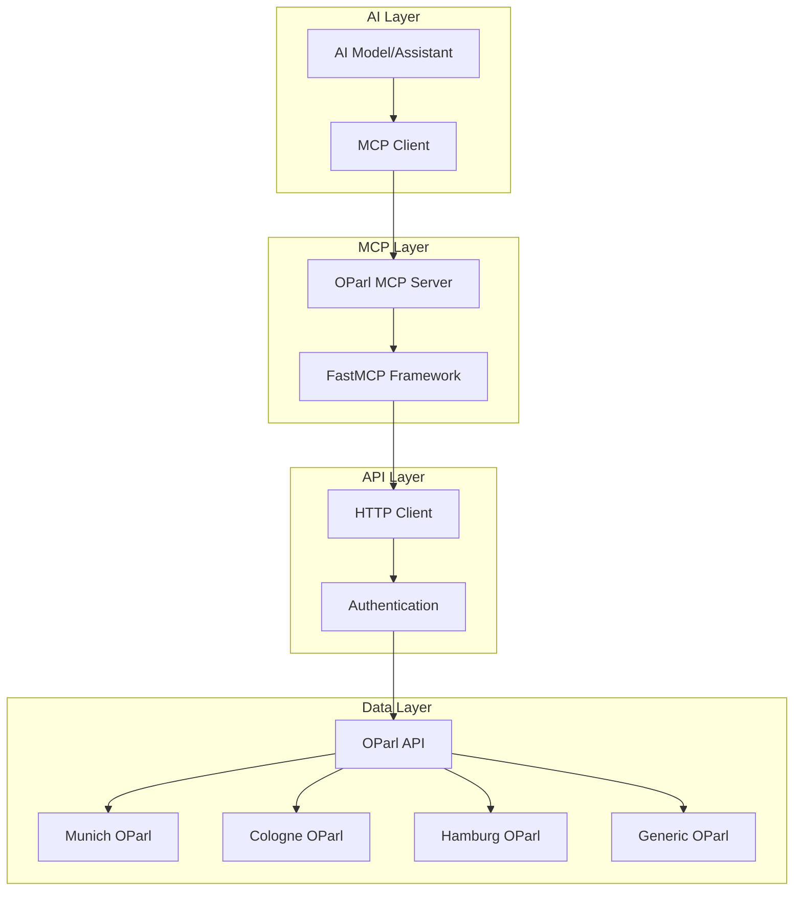
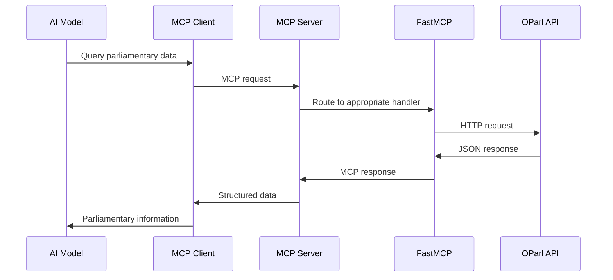
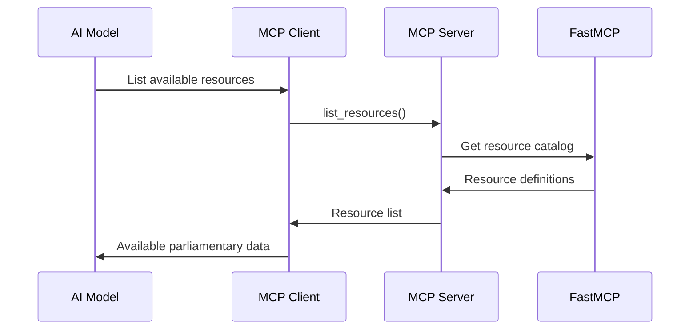
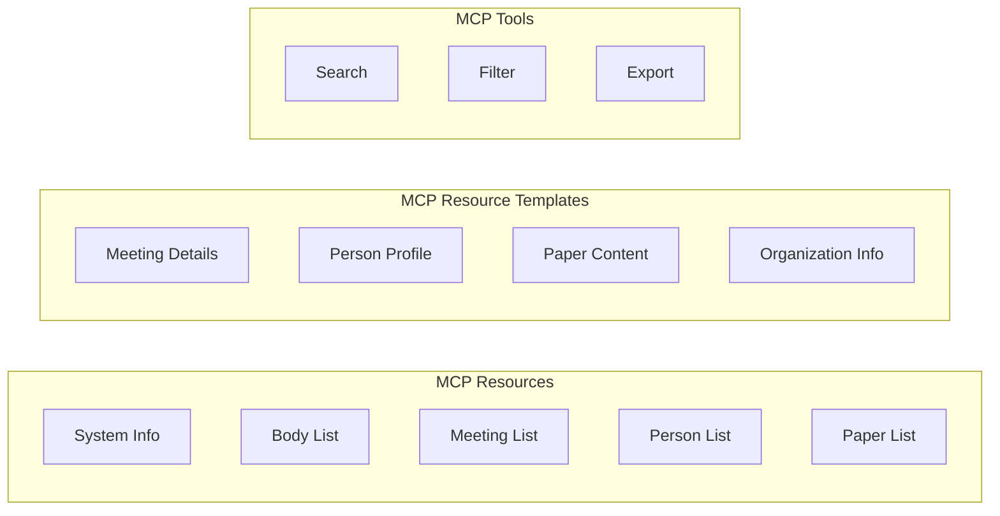
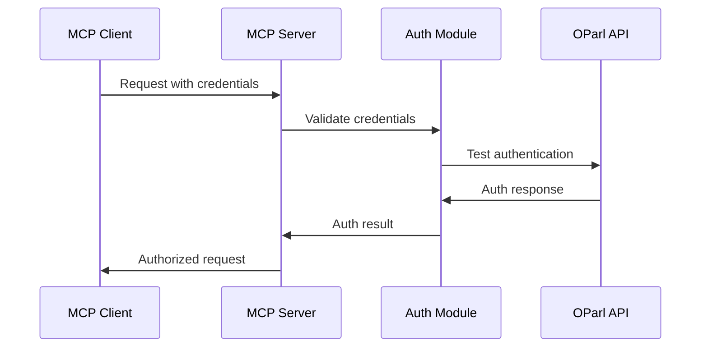
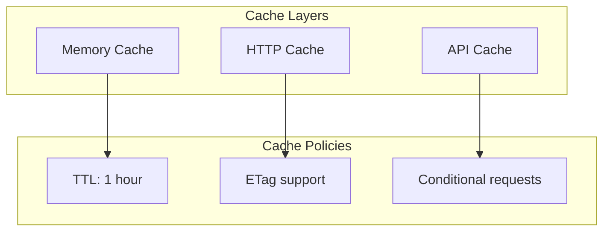
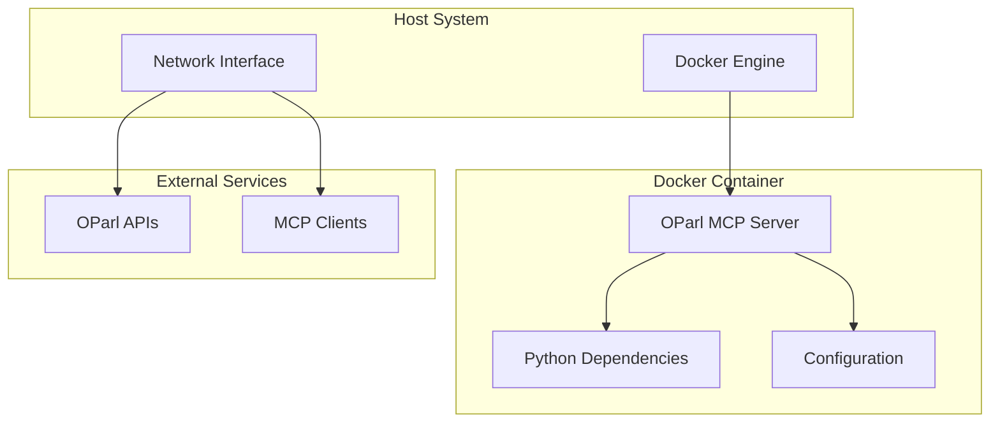
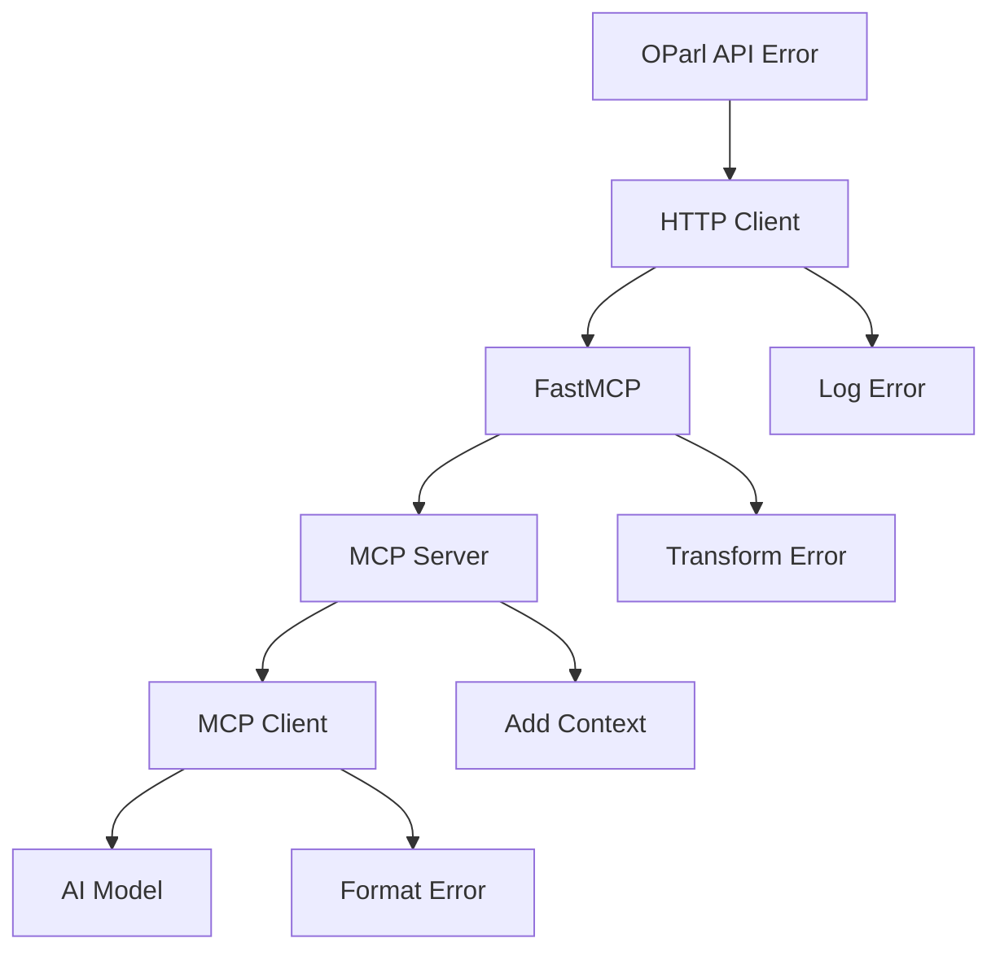

<div align="center">

# System Architecture


**Comprehensive overview of the OParl MCP Server architecture**

This document shows how FastMCP integrates with the OParl API to provide AI models with structured access to parliamentary data.

</div>

## High-Level Architecture



## Component Details

### 1. AI Model/Assistant
- **Purpose**: Consumes parliamentary data via MCP protocol
- **Interface**: MCP client protocol
- **Capabilities**: Natural language queries, data analysis, report generation

### 2. MCP Client
- **Purpose**: Implements MCP protocol for AI model communication
- **Protocol**: Model Context Protocol (MCP)
- **Features**: Resource discovery, tool invocation, data streaming

### 3. OParl MCP Server
- **Purpose**: Main server implementation
- **Components**: Configuration, authentication, route mapping
- **Features**: Multi-tenant support, flexible configuration

### 4. FastMCP Framework
- **Purpose**: OpenAPI to MCP translation
- **Features**: Automatic API mapping, type safety, async support
- **Input**: OpenAPI specification (`oparl_openapi.json`)

### 5. HTTP Client
- **Purpose**: HTTP communication with OParl APIs
- **Library**: httpx (async HTTP client)
- **Features**: Connection pooling, retry logic, timeout handling

### 6. Authentication
- **Methods**: API key, Bearer token, public access
- **Flexibility**: Per-implementation configuration
- **Security**: Secure credential management

### 7. OParl API Implementations
- **Munich**: `https://oparl.muenchen.de`
- **Cologne**: `https://oparl.koeln.de`
- **Hamburg**: `https://oparl.hamburg.de`
- **Generic**: `https://api.oparl.org`

## Data Flow

### 1. Query Processing


### 2. Resource Discovery


## MCP Component Architecture

### Resource Types


### Route Mapping Logic
```mermaid
flowchart TD
    A[HTTP Request] --> B{URL Pattern}
    B -->|/meeting/{id}| C[Resource Template]
    B -->|/meeting| D[Resource]
    B -->|/search| E[Tool]
    B -->|/admin/*| F[Exclude]
    
    C --> G[Individual Meeting Data]
    D --> H[Meeting Collection]
    E --> I[Search Functionality]
    F --> J[Not Exposed]
```

## Configuration Architecture

### Environment-Based Configuration
```yaml
# Environment Variables
OPARL_BASE_URL: "https://oparl.muenchen.de"
OPARL_API_KEY: "your-api-key"
OPARL_TIMEOUT: 30.0
OPARL_LOG_LEVEL: "INFO"
OPARL_SERVER_NAME: "Munich OParl Server"
```

### Multi-Implementation Support
```python
# Configuration for different implementations
configs = {
    "munich": OParlConfig(
        base_url="https://oparl.muenchen.de",
        api_key="munich-key"
    ),
    "cologne": OParlConfig(
        base_url="https://oparl.koeln.de",
        api_key="cologne-key"
    ),
    "generic": OParlConfig(
        base_url="https://api.oparl.org"
    )
}
```

## Security Architecture

### Authentication Flow


### Security Layers
1. **MCP Protocol Security**: Encrypted communication
2. **API Authentication**: Bearer tokens, API keys
3. **Rate Limiting**: Request throttling
4. **Input Validation**: Parameter sanitization
5. **Error Handling**: Secure error responses

## Performance Architecture

### Caching Strategy


### Connection Pooling
```python
# HTTP connection pooling
client = httpx.AsyncClient(
    limits=httpx.Limits(
        max_keepalive_connections=20,
        max_connections=100
    )
)
```

## Deployment Architecture

### Container Deployment


### Scaling Considerations
- **Horizontal Scaling**: Multiple server instances
- **Load Balancing**: Distribute MCP client connections
- **Database**: Optional caching layer
- **Monitoring**: Health checks and metrics

## Error Handling Architecture

### Error Propagation


### Error Types
1. **Network Errors**: Connection timeouts, DNS failures
2. **Authentication Errors**: Invalid credentials, expired tokens
3. **API Errors**: 404 Not Found, 500 Internal Server Error
4. **Validation Errors**: Invalid parameters, malformed requests
5. **Rate Limit Errors**: Too many requests, quota exceeded

## Monitoring and Observability

### Metrics Collection
- **Request Count**: Number of MCP requests
- **Response Time**: API response latency
- **Error Rate**: Failed request percentage
- **Cache Hit Rate**: Cache effectiveness
- **Active Connections**: Current client count

### Logging Strategy
```python
# Structured logging
logger.info(
    "OParl request completed",
    extra={
        "endpoint": "/meeting/123",
        "response_time": 0.245,
        "status_code": 200,
        "client_id": "ai-model-1"
    }
)
```

## Future Architecture Considerations

### Planned Enhancements
1. **GraphQL Support**: More flexible querying
2. **WebSocket Support**: Real-time updates
3. **Batch Operations**: Multiple requests in one call
4. **Custom Aggregations**: Pre-computed data views
5. **Machine Learning**: Predictive analytics

### Scalability Improvements
1. **Microservices**: Split into smaller services
2. **Message Queues**: Async processing
3. **Distributed Caching**: Redis/Memcached
4. **API Gateway**: Centralized routing
5. **Service Mesh**: Advanced networking

## Next Steps

- [OParl API Overview]({{ '/user-guide/oparl-api' | relative_url }}) - Understanding the data source
- [FastMCP Integration]({{ '/user-guide/fastmcp-integration' | relative_url }}) - Technical implementation details
- [MCP Components]({{ '/user-guide/mcp-components' | relative_url }}) - Available tools and resources
- [Examples]({{ '/user-guide/examples' | relative_url }}) - Practical usage scenarios
