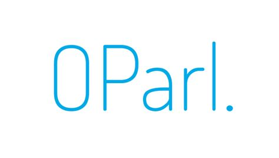

<div class="hero-section">
  <div class="logo-container">
    
    
  </div>
  
  <div align="center">
    <h1 style="color: var(--text-dark); margin-bottom: 20px;">OParl MCP Server</h1>
    <p style="font-size: 1.3em; color: var(--text-gray); max-width: 800px; margin: 0 auto 30px;">
      <strong>A powerful Model Context Protocol (MCP) server that provides seamless access to OParl parliamentary data APIs</strong>
    </p>
    <p style="color: var(--text-gray); max-width: 600px; margin: 0 auto 30px;">
      This server enables AI assistants and applications to interact with parliamentary information systems using a standardized interface.
    </p>
    
    <div class="badge-container">
      <a href="https://github.com/jtwolfe/oparl-mcp-server" target="_blank">
        
      </a>
      <a href="https://github.com/jtwolfe/oparl-mcp-server/fork" target="_blank">
        
      </a>
      <a href="https://github.com/jtwolfe/oparl-mcp-server/blob/main/LICENSE" target="_blank">
        
      </a>
      <a href="https://www.python.org/downloads/" target="_blank">
        
      </a>
      <a href="https://modelcontextprotocol.io" target="_blank">
        
      </a>
    </div>
  </div>
</div>

<div class="status-warning">
  <strong>⚠️ Project Status:</strong> This project is currently in development and requires additional validation and testing. While the core functionality is implemented, it has not been thoroughly tested in production environments. Please use with caution and report any issues you encounter.
</div>

## 🚀 Quick Start

Get started with the OParl MCP Server in minutes:

```bash
# Install the package
pip install oparl-mcp-server

# Run the server
python -m oparl_mcp.server
```

## ✨ Features

<div class="feature-grid">
  <div class="feature-card">
    <h3>🔌 MCP Integration</h3>
    <p>Full Model Context Protocol compliance</p>
  </div>
  <div class="feature-card">
    <h3>🏛️ OParl Support</h3>
    <p>Access to all OParl 1.1 object types</p>
  </div>
  <div class="feature-card">
    <h3>🌐 Multi-Implementation</h3>
    <p>Works with various OParl implementations</p>
  </div>
  <div class="feature-card">
    <h3>🔐 Authentication</h3>
    <p>Support for API key authentication</p>
  </div>
  <div class="feature-card">
    <h3>📊 Rich Data</h3>
    <p>Parliamentary meetings, documents, organizations, and more</p>
  </div>
  <div class="feature-card">
    <h3>🔍 Search</h3>
    <p>Advanced search and filtering capabilities</p>
  </div>
  <div class="feature-card">
    <h3>🐳 Docker Ready</h3>
    <p>Containerized deployment options</p>
  </div>
  <div class="feature-card">
    <h3>🧪 Testing</h3>
    <p>Comprehensive test suite included</p>
  </div>
</div>

## 📚 Documentation

<div style="display: grid; grid-template-columns: repeat(auto-fit, minmax(250px, 1fr)); gap: 20px; margin: 30px 0;">
  <div class="feature-card">
    <h3>🚀 Getting Started</h3>
    <p>Quick setup and basic usage</p>
    <a href="{{ '/getting-started/quickstart' | relative_url }}" class="btn">Get Started</a>
  </div>
  <div class="feature-card">
    <h3>📖 User Guide</h3>
    <p>Comprehensive usage documentation</p>
    <a href="{{ '/user-guide/overview' | relative_url }}" class="btn btn-secondary">Read Guide</a>
  </div>
  <div class="feature-card">
    <h3>🔧 API Reference</h3>
    <p>Complete API documentation</p>
    <a href="{{ '/api/server' | relative_url }}" class="btn btn-secondary">View API</a>
  </div>
  <div class="feature-card">
    <h3>🛠️ Development</h3>
    <p>Contributing and development guide</p>
    <a href="{{ '/development/contributing' | relative_url }}" class="btn btn-secondary">Contribute</a>
  </div>
</div>

## 🏛️ Supported OParl Objects

- **System** - API system information
- **Body** - Parliamentary bodies and institutions
- **Organization** - Political parties and groups
- **Person** - Representatives and officials
- **Meeting** - Parliamentary sessions and events
- **AgendaItem** - Meeting agenda items
- **Paper** - Documents and papers
- **Consultation** - Public consultations
- **File** - Attachments and media
- **Location** - Meeting venues and addresses

## 🌍 OParl Implementations

The server works with various OParl implementations:

- **Generic OParl API** - `https://api.oparl.org`
- **Munich City Council** - `https://oparl.muenchen.de`
- **Cologne City Council** - `https://oparl.koeln.de`
- **Hamburg Parliament** - `https://oparl.hamburg.de`

## 🛠️ Installation

### From PyPI

```bash
pip install oparl-mcp-server
```

### From Source

```bash
git clone https://github.com/jtwolfe/oparl-mcp-server.git
cd oparl-mcp-server
pip install -e .
```

### Docker

```bash
docker run -p 8000:8000 jtwolfe/oparl-mcp-server
```

## 📖 Usage

### Basic Configuration

```python
from oparl_mcp import OParlMCPServer, OParlConfig

# Create configuration
config = OParlConfig(
    base_url="https://api.oparl.org",
    api_key="your-api-key",  # Optional
    timeout=30.0
)

# Create and run server
server = OParlMCPServer(config)
server.run()
```

### Environment Variables

```bash
export OPARL_BASE_URL="https://api.oparl.org"
export OPARL_API_KEY="your-api-key"
export OPARL_TIMEOUT="30.0"
export OPARL_LOG_LEVEL="INFO"
```

## 🤝 Contributing

We welcome contributions! Please see our [Contributing Guide]({{ '/development/contributing' | relative_url }}) for details.

## 📄 License

This project is licensed under the MIT License - see the [LICENSE]({{ '/about/license' | relative_url }}) file for details.

## 🙏 Acknowledgments

- [OParl](https://oparl.org/) for the parliamentary data standard
- [FastMCP](https://gofastmcp.com/) for the MCP framework
- The open-source community for inspiration and support

---

**Ready to get started?** Check out our [Quick Start Guide]({{ '/getting-started/quickstart' | relative_url }}) or explore the [API Reference]({{ '/api/server' | relative_url }}).
